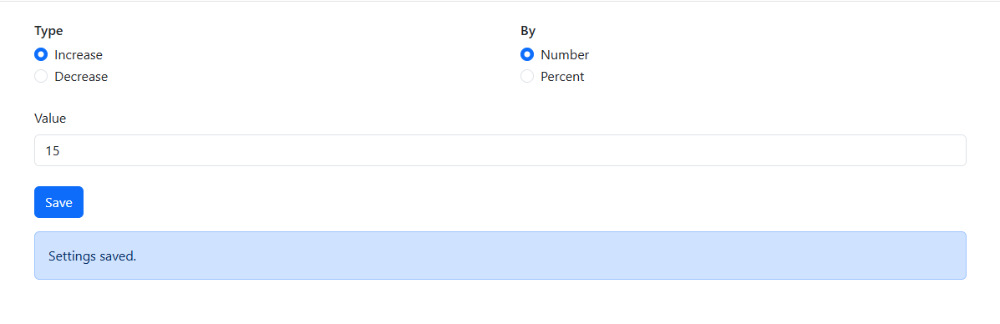
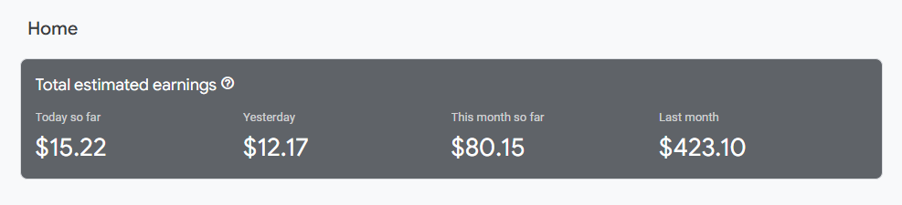

# AdMock

A Chrome extension for AdMob earning prank. It also technically supports on other chromium based browsers.

> [!NOTE]\
> AdMock does not affiliate with Google AdMob, and it's not the product of Google.

| Options                              | Prank result                        |
|--------------------------------------|-------------------------------------|
|  |  |

## Installation

1. [Download](https://github.com/kaungkhantjc/AdMock/archive/refs/heads/main.zip) this repository as zip file and extract it.
2. Go to the Extensions page by entering `chrome://extensions` in a new tab.
3. Enable Developer Mode by clicking the toggle switch next to **Developer mode**.
4. Click the **Load unpacked** button and select `dist` folder

> Learn more about loading an unpacked extension [here](https://developer.chrome.com/docs/extensions/get-started/tutorial/hello-world#load-unpacked).

### Customize options
- Click 3 dots menu next to the extension icon and choose **Options**. Or go to the extension's **Details** page and click **Extension options**.

> Learn more about the options page [here](https://developer.chrome.com/docs/extensions/develop/ui/options-page#view_page).

## Contributing

We appreciate any contributions to AdMock! Follow the steps below to contribute:

1. Fork the repository to your GitHub account.
2. Run `npm install` to set up TypeScript definition for Chrome Extensions.
3. Submit a Pull Request (PR) with the changes.

## License

AdMock is released under the Apache 2.0 license.

    Copyright 2024 AdMock Contributors

    Licensed under the Apache License, Version 2.0 (the "License");
    you may not use this file except in compliance with the License.
    You may obtain a copy of the License at

        http://www.apache.org/licenses/LICENSE-2.0

    Unless required by applicable law or agreed to in writing, software
    distributed under the License is distributed on an "AS IS" BASIS,
    WITHOUT WARRANTIES OR CONDITIONS OF ANY KIND, either express or implied.
    See the License for the specific language governing permissions and
    limitations under the License.
